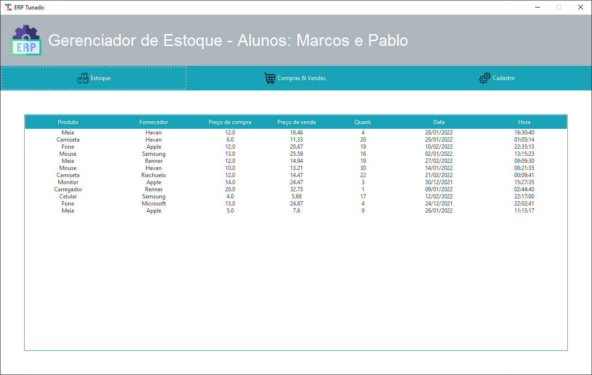
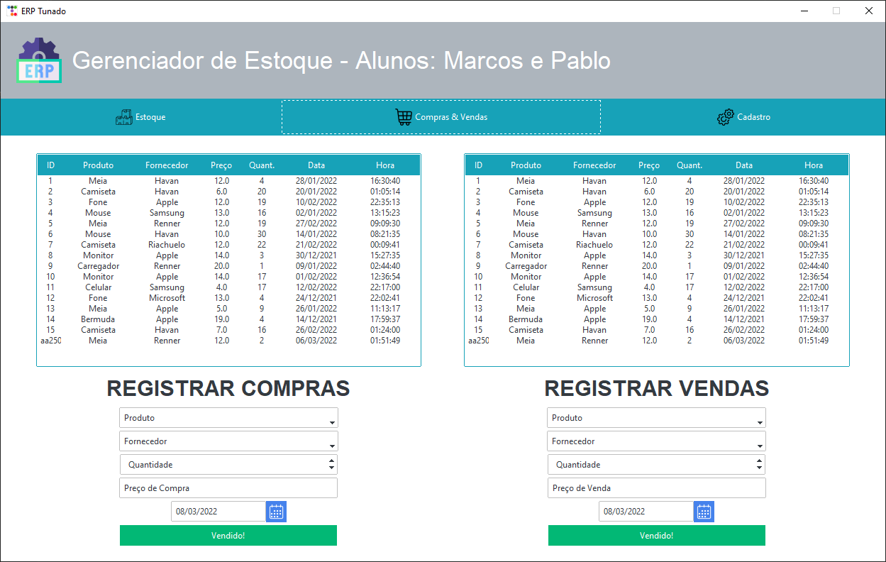
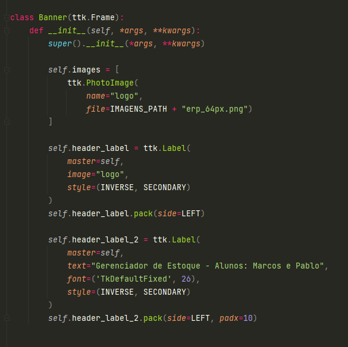

# **Funcionamento da Aplicação**

## **O que ela faz**

A ideia inicial da aplicação era de tentar simular, de maneira simplificada, um Gestor de Estoques. Dessa forma, as
principais atividades exercicidas seriam:

- Realizar o cadastro das entradas e saídas;
- Retornar o estoque existente.

Com isso em mente, conseguimos implementar as seguintes funções:

- Cadastro de Fornecedores
- Cadastro de Produtos
- Registro de Compra
- Registro de Venda
- Listas dos Registros Realizados
- Listas dos Cadastros Realizados
- Calculo do Estoque

## **Descrição das Telas**

### **Estoque**

O intuito desta tela está em mostrar o estoque atual existente, que toma como base todos os registros de compras e
vendas realizados na aplicação.

Para mostrar os resultados, foi utilizado o widget treeview da lib ttkbootstrap, pois pensamos que o resultado final
ficaria mais elegante e interessante.

Nesta tela não foi colocada nenhuma interação com o usuário, visto que seu objetivo está apenas em mostrar os resultados
obtidos.

### **Compras & Vendas**

Esta tela tem como função a realização dos registros de compras e vendas de todos os produtos que farão parte do estoque
da companhia.

Para tal, determinamos alguns campos para preenchimento de alguns dados básicos referente à operação que deve ser
realizada. Desse modo, conseguimos montar um registro básico referente às compras e vendas que acontecem na companhia
utilizando as seguintes informações:

1. Nome do produto;
2. Nome do fornecedor;
3. Quantidade a ser vendida ou comprada;
4. Preço de custo ou venda do produto;
5. e a Data da operação a ser realizada.

Após o preenchimento dos dados corretos, o botão verde realiza o cadastro no respectivo banco de dados, enquanto o botão
vermelho, o remove. Além disso, o banco de dados é atualizado toda vez que um item for cadastrado ou removido. Este
processo pode ser visualizado na lista em tempo real.

### **Cadastro**

A tela de cadastro existe para fazer um controle mais detalhado dos produtos e fornecedores que participam da operação
da empresa. Seria nesta tela onde teriam todas as informações de contato dos fornecedores e as características
específicas dos produtos, mas estas funcionalidades não faziam parte do escopo inicial deste projeto, por isto não foram
adicionadas.

Desse modo, os únicos campos de cadastro necessários para fazer o estoque funcionar de maneira básica são:

1. Para o caso do Produto:
   1. Nome do novo produto a ser cadastrado na base de dados;
   2. O nome do fornecedor deste produto.
2. Para o caso do Fornecedor:
   1. Apenas o nome do novo fornecedor que será adicionado à base.

Estamos cientes que existem diversas outras maneiras para permitir que o usuário realize este cadastro, mas optamos por
fazer algo diferente e que manteve o padrão visual dos registros de compras e vendas.

## **Como Executar a Aplicação**

Basta executar o arquivo main.py

## **Nome da Aplicação**

ERP Tunado

## **Conceitos de OOP Utilizados e Por que**

### **Classes, Objetos e Herança**

Facilitam a organização e reutilização dos códigos. Optamos por fazer de cada frame, uma classe. Isso nos permitiu um
código mais legível e de mais fácil manutenção, pois sabemos exatamente onde procurar no código quando determinada
atividade da aplicação não está funcionando de acordo.

Para exemplificar, fica fácil de perceber na imagem abaixo que todos os componentes que fazem parte do Banner da
aplicação estão contidos na classe 'Banner', como as duas labels e a imagem "logo" utilizada na primeira.

### **Polimorfismo**

Excelente para organização do código-fonte, pois conseguimos deixá-lo muito mais enxuto, sem

??????????????????? FOTO DO CODIGO

### **Encapsulamento**

Facilitam a organização e reutilização dos códigos.

??????????????????? FOTO DO CODIGO

## **Papel de Cada Membro da Equipe**

1. Nome: Marcos Rogério Grave
   - Matrícula: 940246
   - Papel: o aluno não possuía familiaridade com as libs e orientação a objeto, então suas atividades foram mais
     básicas, como a criação dos botões, entradas, organização das classes e heranças de uma maneira mais simplificada,
     funções do banco de dados, dentre outros.

2. Nome: Pablo Von Knoblauch Fontão
   - Matrícula: 940215
   - Papel: como o aluno já possuía uma maior familiaridade com as libs e com o paradigma orientado a objetos, as
     atividades mais complexas foram executadas por ele, tais como a treeview, a estrutura do app, a organização mais
     complexa das classes e heranças, funções de atualização do banco de dados, dentre outros.

## **Comentários da Equipe**

Além do próprio funcionamento da aplicação, procuramos dar atenção à sua estética e usabilidade, utilizando de algumas
ferramentas e estratégias de interação para tentar atingir este objetivo, como a lib do ttkbootstrap, os botões com
imagens ao invés de abas monótonas, as listas mostrando o cadastro sendo realizado em tempo real, dentre outros.

Não obstante, nos esforçamos para deixar o código-fonte próximo do aceitável, conforme os padrões da comunidade de
desenvolvimento. Desse modo, tentamos nomear as variáveis, funções e classes de maneira mais eficiente; separamos os
maiores grupos em arquivos distintos; tentamos reutilizar códigos; e procuramos organizar as funcoes e classes de
maneira a tornar o código mais legível.

Gostaríamos de ter deixado o código ainda melhor e com mais funcionalidades, mas não conseguimos planejar tempo
suficiente para torná-los realidade.

## **Link do Vídeo da Equipe**

??????????????? LINK DO VIDEO DA EQUIPE
