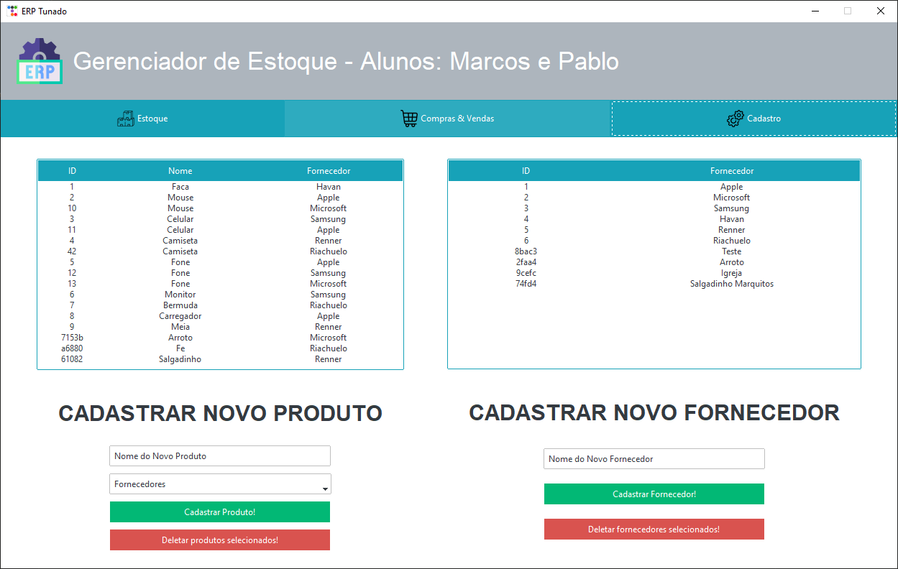

# **Funcionamento da Aplicação**

## **O que ela faz**

A ideia inicial da aplicação era de tentar simular, de maneira simplificada, um Gestor de Estoques. Dessa forma, as principais atividades exercicidas seriam:

- Realizar o cadastro das entradas e saídas;
- Retornar o estoque existente.

Com isso em mente, conseguimos implementar as seguintes funções:

- Cadastro de Fornecedores
- Cadastro de Produtos
- Registro de Compra
- Registro de Venda
- Listas dos Registros Realizados
- Listas dos Cadastros Realizados
- Calculo do Estoque

## **Decrição das Telas**

### **Estoque**

O ituito desta tela está em mostrar o estoque existente com base em todos os registros de compras e vendas realizados.

????????????????????? FOTO DO ESTOQUE

### **Compras & Vendas**

Esta tela tem como função a realização dos registros de compras e vendas texto ?????????????????

### **Cadastro**

texto ?????????????????

## **Como Executar a Aplicação**

texto ?????????????????

## **Nome da Aplicação**

ERP Tunado

## **Conceitos de OOP Utilizados e Por quê**

??????????????????? TRAZER TECHOS DE CODIGO

### **Classes e Objetos**

Facilitam a organização e reutilização dos códigos.

??????????????????? FOTO DO CODIGO

### **Heranças**

Facilitam a organização e reutilização dos códigos.

??????????????????? FOTO DO CODIGO

## **Papel de Cada Membro da Equipe**

1. Nome: Marcos Rogério Grave
   - Matrícula: 940246
   - Papel: o aluno não possuía familiaridade com as libs e orientação a objeto, então suas atividades foram mais básicas, como a criação dos botões, entradas, organização das classes e heranças de uma maneira mais simplificada, funções do banco de dados, dentre outros.
2. Nome: Pablo Von Knoblauch Fontão
   - Matrícula: 940215
   - Papel: como o aluno já possuía uma maior familiaridade com as libs e com o paradigma orientado a objetos, as atividades mais complexas foram executadas por ele, tais como a treeview, a estrutura do app, a organização mais complexa das classes e heranças, funções de atualização do banco de dados, dentre outros.

## **Comentários da Equipe**

Além do próprio funcionamento da aplicação, procuramos dar atenção à sua estética e usabilidade, utilizando de algumas ferramentas e estatégias de interação para tentar atingir este objetivo, como a lib do ttkbootstrap, os botões com imagens ao invés de abas monótonas, as listas mostrando o cadastro sendo realizado em tempo real, dentre outros.

Não obstante, nos esforçamos para deixar o código fonte próximo do aceitável, conforme os padrões da comunidade de desenvolvimento. Desse modo, tentamos nomear as variáveis, funções e classes de maneira mais eficiente; separamos os maiores grupos em arquivos distintos; tentamos reutilizar códigos; e procuramos organizar as funcoes e classes de maneira a tornar o código mais legível.

Gostaríamos de ter deixado o código ainda melhor e com mais funcionalidades, mas não conseguimos planejar tempo suficiente para torná-los realidade.

## **Link do Vídeo da Equipe**

??????????????? LINK DO VIDEO DA EQUIPE
